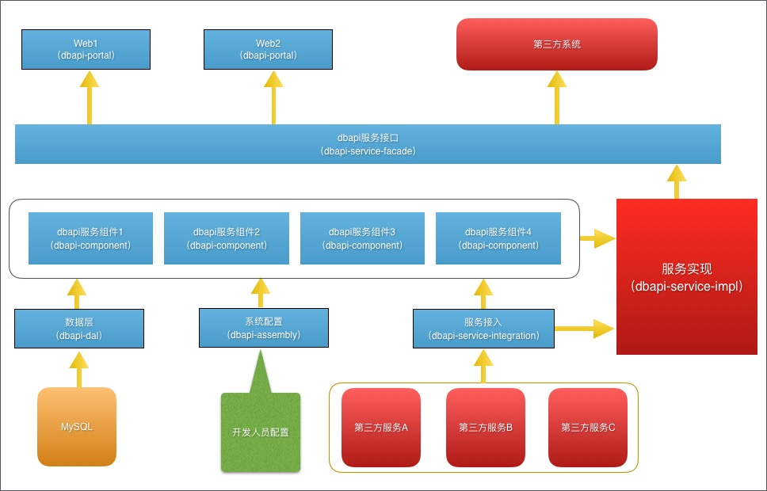

#smart-boot

##工程结构

- smart-assembly   
用于集中管理smart-boot工程中各Spring配置文件所需的属性配置
- smart-dal  
数据操作层bundle,实现数据存储读取操作。
- smart-service-integration  
与外部第三方系统对接的bundle，以供smart-boot调用第三方服务
- smart-component  
组件bundle，遵循单一职责原则，向下对接smart-dal、smart-service-integration，向上为业务层smart-service-impl提供各组件式服务
- smart-service-facade  
定义smart-boot的服务接口，一个独立的bundle,不依赖其他模块。未来第三方系统可通过该bundle提供的接口调用服务
- smart-service-impl  
该bundle通过引用smart-componet提供的各组件用于实现smart-service-facade中定义的接口。对于私有服务可直接在本bundle中定义接口，无需放置在smart-service-facade中.  

>为方便使用，也可直接调用smart-service-integration中提供的服务

- smart-shared  
该bundle完全独立于业务，主要用于提供一下工具类，可被任一bundle引用
- smart-restful  
Web层，仅负责前后端的数据交互，不建议在该bundle中进行复杂的业务处理，应统一交由smart-service-impl处理

##运行系统
dbapi-restful模块中运行BootStrap.java

1. 如果工程运行依赖数据库，请在application-dev.properties中设置要数据库配置后再运行

2. 如果工程并不需要数据库,需要屏蔽smart-dal，需要对smart-component中的pom.xml文件进行修改，找到

	<dependency>
			<groupId>net.vinote.smartboot</groupId>
			<artifactId>smart-dal</artifactId>
	</dependency>
	修改为
	<dependency>
			<groupId>net.vinote.smartboot</groupId>
			<artifactId>smart-assembly</artifactId>
	</dependency>

##smart-boot特点
- 研发：
	模块化编程、面向服务编程、测试框架
- 部署：
	eclipse，tomcat
- 管控：
	统一上下文，动态路由，监控日志，地址池，故障隔离，精细化管控，jvm监控。。。

##smart-boot依赖
1. Mysql 默认对接mysql数据库，可根据实际项目需要重新进行配置
2. Redis 默认使用redis提供缓存服务，可根据实际项目需要重新进行配置
3. [smart-sosa](https://git.oschina.net/smartdms/smart-sosa) 提供底层RPC服务
4. [maven-mybatisdalgen-plugin](https://git.oschina.net/smartdms/maven-mybatisdalgen-plugin) 数据层采用了mybatis框架，通过该maven-mybatisdalgen-plugin插件可以方便的生成DAL层的代码以及配置文件。

##发布RPC服务

	<!-- RMI Service -->
	<bean name="rmiServer" class="net.vinote.sosa.core.rmi.RmiServer" init-method="init" destroy-method="destory" lazy-init="false">
		<property name="properties">
			<props>
				<prop key="port">${rmiPort}</prop>
			</props>
		</property>
	</bean>
	<bean name="demoServiceImpl" class="net.vinote.smartboot.service.demo.impl.DemoServiceImpl" />
	<bean id="demoService" class="net.vinote.sosa.core.rmi.RmiServerFactoryBean" init-method="publishService">
		<property name="interfaceName" value="net.vinote.smartboot.service.demo.facade.DemoService" />
		<property name="interfaceImpl" ref="demoServiceImpl" />
		<property name="rmiServer" ref="rmiServer" />
	</bean>

##引用RPC服务
	<!-- RMI服务 -->
	<bean name="rmiClient" class="net.vinote.sosa.core.rmi.RmiClient" destroy-method="destory" lazy-init="false" init-method="init" />
	<bean id="demoService" class="net.vinote.sosa.core.rmi.RmiClientFactoryBean">
		<property name="rmiClient" ref="rmiClient" />
		<property name="remoteInterface" value="net.vinote.smartboot.service.order.facade.DemoService" />
		<property name="timeout" value="5000" />
	</bean>

##日志系统log4j2
### 为什么选用log4j2?  
1. Apache Log4j 2 is an upgrade to Log4j that provides significant improvements over its predecessor, Log4j 1.x, and provides many of the improvements available in Logback while fixing some inherent problems in Logback's architecture. 一句话总结，官方号称log4j2比log4j和logback都牛逼.
2. 配置简单集中，修改smart-assembly中的log4j2.xml即可实现整个工程的日志管理。

##生成maven archetype
1.mvn clean
清除eclipse工程编译产生的文件  
2.mvn archetype:create-from-project  
3.拷贝/smart-boot/target/generated-sources/archetype/src/main/resources/archetype-resources至/smart-boot-archetype/src/main/resources/archetype-resources  
4.进入/smart-boot-archetype/src/main/resources/archetype-resources目录清除隐藏文件

>
	find . -name \.settings -exec rm -r {} \;
	find . -name \.externalToolBuilders -exec rm -r {} \;
	find . -name \.project -exec rm -r {} \;
	find . -name \.classpath -exec rm -r {} \;
>
	
5.覆盖/smart-dal/src/main/resources目录下的文件至/smart-boot-archetype/src/main/resources/archetype-resources/smart-dal/src/main/resources  
6.编辑log4j2.xml,pom.xml  

已生成现成的archetype，参见[smart-boot-archetype](https://git.oschina.net/smartdms/smart-boot-archetype)

##推荐项目
- [smart-socket](https://git.oschina.net/smartdms/smart-socket)
- [smart-sosa](https://git.oschina.net/smartdms/smart-sosa)
- [maven-mybatisdalgen-plugin](https://git.oschina.net/smartdms/maven-mybatisdalgen-plugin)

##关于作者
Edit By [Seer](http://zhengjunweimail.blog.163.com/)  
E-mail:zhengjunweimail@163.com  
QQ:504166636

Update Date: 2016-03-23